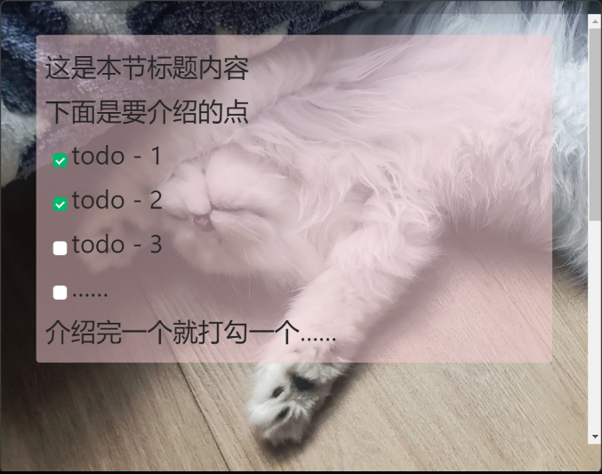
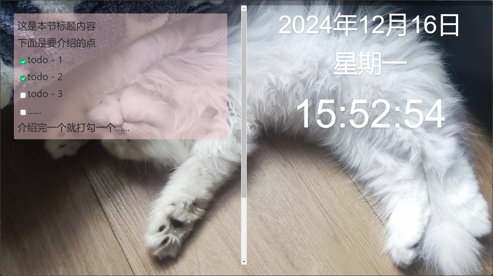

- 基于 [electron](https://github.com/Tdahuyou/electron).0056 笔记的二开。
- 嵌入了一个语雀编辑器，用于在录制视频前编写视频内容概述信息，在讲解过程中就参考着编写的点逐一讲解。
- 不同尺寸下的预览效果：
  - 
  - 
  - 
- 在视频开始前，编写好本节的概述信息，然后全屏。
- 在介绍相关内容的时候，直接将窗口缩小都一边儿。
- 在讲解过程中若有信息需要编辑，也可以丢到编辑器中暂存一下。
- 内容搬运到语雀中格式不会被破坏。
- 快捷方式跟语雀编辑器一致，比如 ctrl alt 再加上 - 号或者 + 号，可以实现文本的缩放，`:::` 可以快速生成高亮块，`ctrl /` 可以一键唤起工具箱。
